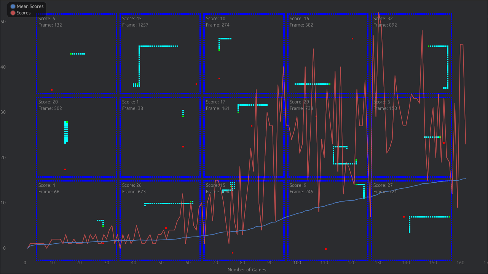

### Snake game AI
Project to train the machine how to play [Snake](https://en.wikipedia.org/wiki/Snake_(video_game_genre)).
Based on [this](https://github.com/patrickloeber/snake-ai-pytorch/) repository, but using the rust bindings for PyTorch

### Differs!
The design in the current version is a bit different, and produces different results than the original model, see version [v1.0.0](https://github.com/Robsutar/snake-tch-rs/tree/v1.0.0) for a result that is the same as the original project.

### Getting Started
You need cargo (rust package manager) and libtorch 2.4.0